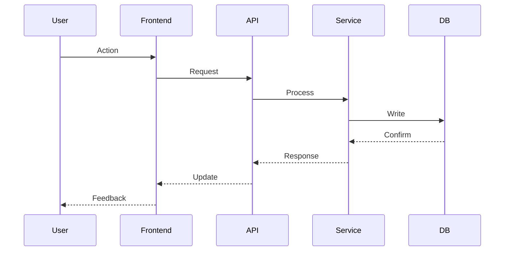
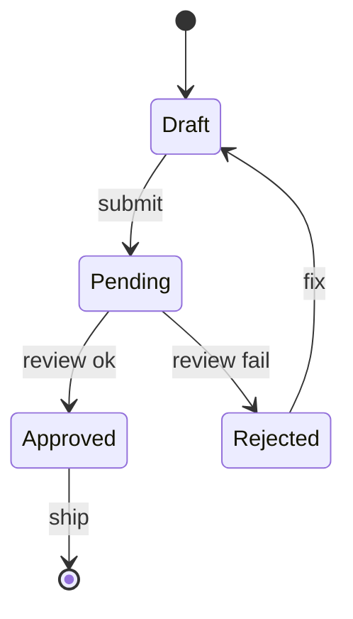

# Design — {{FEATURE_ID}}

> **LOCKED**: Este documento é imutável após approve. Mudanças requerem novo ciclo.

## Overview
[Resumo de 3-5 linhas do que estamos construindo]

## Context Diagram
```mermaid
graph TD
    A[User] --> B[{{Feature}}]
    B --> C[Database]
    B --> D[External API]
```

## Data Flow


## File Structure Plan
```
src/
├── features/
│   └── {{feature_name}}/
│       ├── api/
│       │   ├── routes.ts          # _Boundary_: HTTP interface
│       │   └── validators.ts      # _Boundary_: Input validation
│       ├── service/
│       │   ├── index.ts           # _Boundary_: Business logic
│       │   └── types.ts
│       ├── repository/
│       │   └── index.ts           # _Boundary_: Data access
│       └── components/
│           ├── {{Component}}.tsx  # _Boundary_: UI layer
│           └── {{Component}}.test.tsx
└── shared/
    └── utils/
        └── {{helper}}.ts          # _Depends_: none
```

## State Machine


## Error Handling
| Error | HTTP | User Message | Log Level | Action |
|-------|------|--------------|-----------|--------|
| Validation | 400 | "Check your input" | WARN | Return details |
| Not Found | 404 | "Not found" | INFO | — |
| Conflict | 409 | "Already exists" | WARN | Suggest retry |
| Internal | 500 | "Something went wrong" | ERROR | Alert on-call |

## Security Considerations
- [Threat 1]: [Mitigação]
- [Threat 2]: [Mitigação]

## Performance Budget
- API response: < 200ms p95
- Page load: < 1.5s LCP
- Bundle size: < 100KB gzipped

## Decisions
1. [ADR-001]: [Decisão arquitetural] — [Rationale]
2. [ADR-002]: [Decisão arquitetural] — [Rationale]
